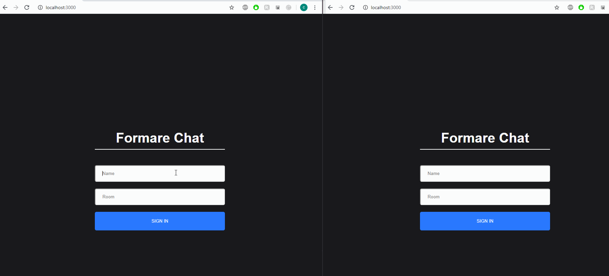

## :file_folder: The Project
**Chat app** was developed for learning purposes and as part of a challenge of an apply for an internship job at Formare Associados.

## :rocket: Technologies
It was built using NodeJS, Express, React and SocketIO.

## :camera: GIF

## Available Scripts

In frontend and backend directories separately, you can run:

### `npm install`

And then

### `npm start`

The app will run in the development mode. 
Open [http://localhost:3000](http://localhost:3000) to view it in the browser.